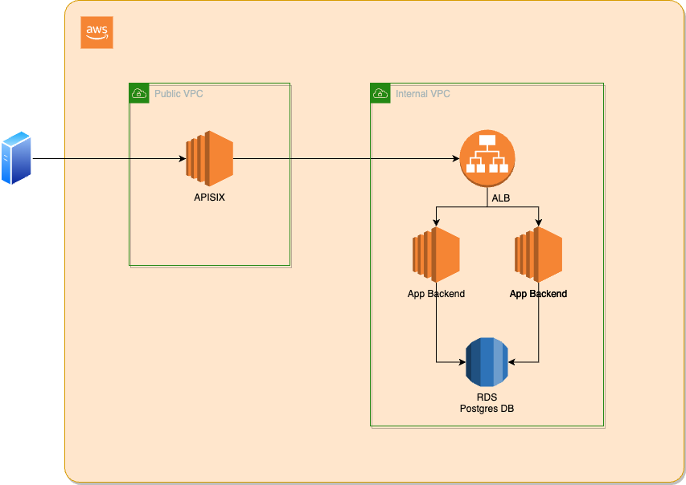
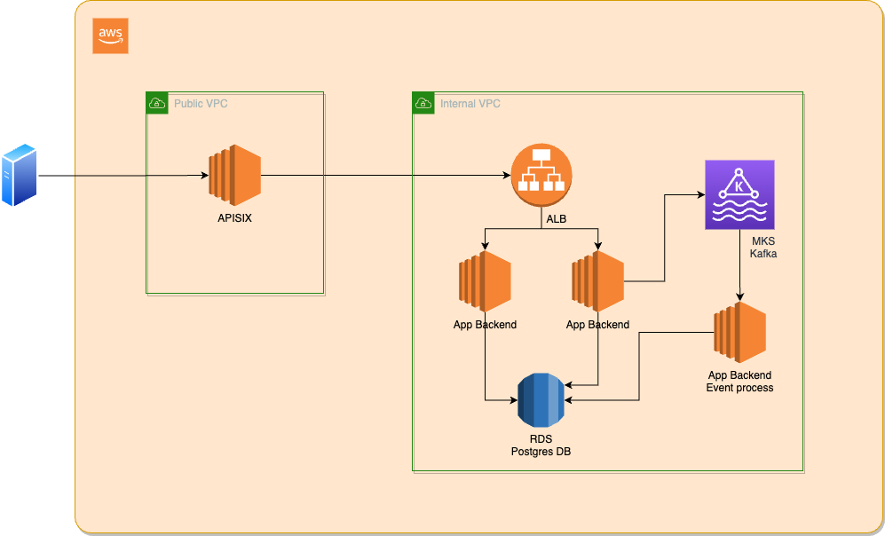

# Xepelin Challenge

Según lo hablado, solo he implementado el backend, aunque no he dispuesto del tiempo que me hubiese gustado para implementar
todas las funcionalidades.
Algo que cabe mencionar, es que la solución funciona con una única base de datos (Postgres), pero dependiendo del uso se podría analizar que lo
que es escrituras y lecturas estén en bases distintas, ya sea bases distintas en la misma instancia, instancias distintas o incluso distintas tecnologías
de base de datos, por ej., Postgres para escribir los logs de eventos y un redis (o elastic search si la complejidad de las consultas lo requiriera) para la lectura.


## Funcionalidad Pendiente

Faltantes o a mejorar:
- Faltan test unitarios para los controllers
- Actualmente, el servicio de API Gateway está configurado con Basic Auth, habría que mejorar la configuración como para usar algo como OIDC/OAuth
  integrándolo con servicios como Keycloak
- Agregar tests de integración
- Falta validación para no retirar dinero si el monto a retirar es mayor al disponible en la cuenta
- El código de los repositories son algo complejos dado que están insertando en las tablas que se usan para escribir el log de eventos como la lectura
- Dado lo anterior, habría que tener un proceso que a partir del log de eventos actualice la tabla de lectura,
  este proceso puede ser algo de la misma aplicación (thread, stream, etc.) que publique los eventos en un "message queue" como Kafka o
  una aplicación externa como Debezium. Si bien el proceso podría actualizar la base de datos directamente, el uso de Kafka lo haría más escalable
- Tener algún mecanismo de snapshots, para en caso de tener que recrear la base de lectura, no necesitar leer el historial completo
- Configurar CI (ej. GitHub Actions)

## Documentación de API

### Crear cuenta

Utilizando `docker-compose` si se quiere acceder directamente a la aplicación, se puede ustilizar el puerto `8081`,
y agregar el header `X-Customer-Id` con un UUID como valor.

```shell
curl --location 'http://localhost:8080/accounts' \
--header 'Content-Type: application/json' \
--header 'Authorization: Basic dGVzdHU6dGVzdHA=' \
--data '{
    "name": "Pepe",
    "account_number": "AAB123"
}'
```

### Obtener el balance de cuenta

```shell
curl --location 'http://localhost:8080/accounts/0b44dd18-3ff3-45e5-8fc2-c4ec050a714a/balance' \
--header 'Authorization: Basic dGVzdHU6dGVzdHA='
```

### Realizar una transacción

```shell
curl --location 'http://localhost:8080/transactions' \
--header 'Content-Type: application/json' \
--header 'Authorization: Basic dGVzdHU6dGVzdHA=' \
--data '{
    "account_id": "0b44dd18-3ff3-45e5-8fc2-c4ec050a714a",
    "transaction_type": "DEPOSIT",
    "_transaction_type": "WITHDRAW",
    "amount": 10300
}'
```

## Cómo ejecutar la aplicación

### Ejecutar con docker-compose

```shell
docker-compose up
```

#### Limpiar recursos generados una vez finalizadas las pruebas

```shell
docker-compose down --remove-orphans --volumes
```

### Ejecutar tests

Si se dispone de make:
```shell
cd backend
make test
```

Sino:
```shell
cd backend
go test ./...
```

### Ejecutar test con cobertura

Si se dispone de make:
```shell
cd backend
make test-coverage
```

Sino:
```shell
cd backend
mkdir -p coverage
go test -coverprofile=coverage/profile.out ./... && go tool cover -html=coverage/profile.out -o coverage/coverage.html
```

En `backend/coverage/coverage.html` se encontrará el reporte de cobertura.


## Infraestructura recomendada en AWS

Algunas cuestiones a mencionar:
- Actualmente se utiliza Apache APISIX como API Gateway, en AWS también se podría optar por la opción de utilizar el servicio de AWS API Gateway
  o ALB (Application Load Balancer) con la integración de AWS Cognito para resolver problemas de autenticación y permisos
- Estas no son las únicas formas de integrar autenticación en la plataforma, solo algunas opciones
- En los diagramas muestro las aplicaciones corriendo en EC2 como el caso más simple, pero iría por configurar ECS o EKS (Kubernetes) dependiendo el caso
- Los diagramas están simplificados y pueden faltar servicios como AWS NAT Gateway, etc.


### Infraestructura para la implementación actual



### Infraestructura para la implementación con bus de eventos


